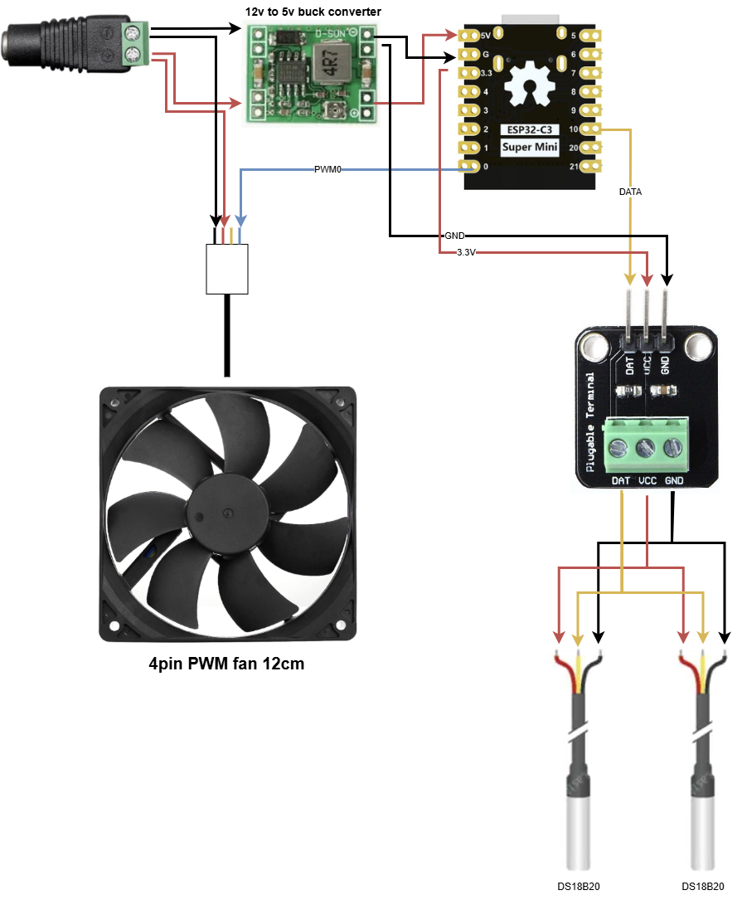

# FAN MANAGER: FanMan
This proyect allows to control up to 8 individual fan speed based on absolute temperature control or relative to a reference temperature.
The speed is calculated linearly based on the speed range configured per fan and the temperatures readed.
If relative control is enabled (default) the speed is calculated based on the diference between the reference temperature and each fan sensor added.
If you want to control multiple fans simultaneously, you can share the same senbsor address.
The WIFI connection hgas a timeout of 10 minutes that it's reset every time you acces the REST API. You can disable the automatic turn off.


# Requisites:
1. Visual Studio Code
2. PlatformIO plugin

# Pinout:
1. PWM pins: from 0 to 7
2. Pin 8 is used to light the onboard LED when speed changes.
3. Pin 10 is used for the sensors
4. Pin 9 is free if you want to add some extra funcionality.
5. Pins 20 & 21 also free, but be careful.

# Instructions:
1. Connect all the sensors and fans following the schematic.
2. Compile and upload the binary to the ESP32-C3 module.
3. Connect to the AP named: "FanMan" & open the browser.
4. Configure your WIFI credentials in the cautive portal. NOTE: ESP32C3 needs 2.4GHz WIFI.
5. Configure the fans accessing the REST APIs.

# Configuration:
1. Call "/scan" while touching a sensor at a time to get every fan address and label the sensors.
2. If using relative temperature control, assign one address to the reference sensor.
3. Assign one address to each fan, or share an address if wanted.
4. Enable the number of fans added, from 1 to 8.

# Updating with OTA
The firmware has enabled OTA updating using "ElegantOTA" library.
You can access the OTA web page at "/update".
NOTE: If wifi auto-off is enabled, you may have to reboot the ESP manually to enable WIFI connection again.
1. Compile the project
2. Access "/update"
3. Upload the file at: {project dir}/.pio/build/esp32-c3-devkitm-1/firmware.bin
When succedded, the ESP will reboot itself using the new firmware.

# REST APIs
This are all the APIS available.
CORS is enabled by default.

## [GET] /
Get current status of all enabled PWM outputs.
NOTE: if all fans have absolute temperature control, "tmp-ref" will not be added to the response.
```
{
  "tmp-ref": 24.5,
  "fans":
  [
    "tmp": 25.123,
    "pwm": 128,
    "timmer": 0,
    "stopping": false,
  ]
}
```

## [GET] /scan
Use this endpoint to retireve the sensor address to associate with the reference sensor & fans.
Scan for all connected temperature sensors & show their temperature.
Result:
```
[
  {
    "addr": [40,136,179,87,4,225,60,56],
    "tmp": 25.125
  }
]
```

## [GET] /?fan=X
Get detailed info for fan x, including configuration
```
{
  "tmp": 25.123,
  "pwm": 128,
  "timmer": 0,
  "stopping": false,
  "addr": [40,136,179,87,4,225,60,56]
  "absolute": false,
  "pwm-min": 64,
  "pwm-max": 255,
  "diff-min": 1,
  "diff-max": 5
}
```

## [POST] /set?fan=X
Change configuration, include only the values you want to modify:
NOTE:
1. PWM values range: [0-255]
2. "diff-min" & "diff-max" are float and can use decimals, ej: 25.23
Body:
```
{
  "addr": [40,136,179,87,4,225,60,56]
  "pwm-min": 64,
  "pwm-max": 255,
  "diff-min": 1,
  "diff-max": 5,
  "absolute": false
}
```

## [POST] /set?fan=X
Set PWM value during X seconds:
NOTE: If timmer is set to "-1", the pwm value will be permanent until reboot.
```
{
	"pwm": 255,
	"timmer": 15
}
```

## [GET] /set
Set general configuration. Only add needed properties to the body.
The property "addr" will set the reference temperature sensor.
Example:
```
{
  "addr": [40,136,179,87,4,225,60,56],
	"fans": 1,
	"auto-wifi-off": false
}
```